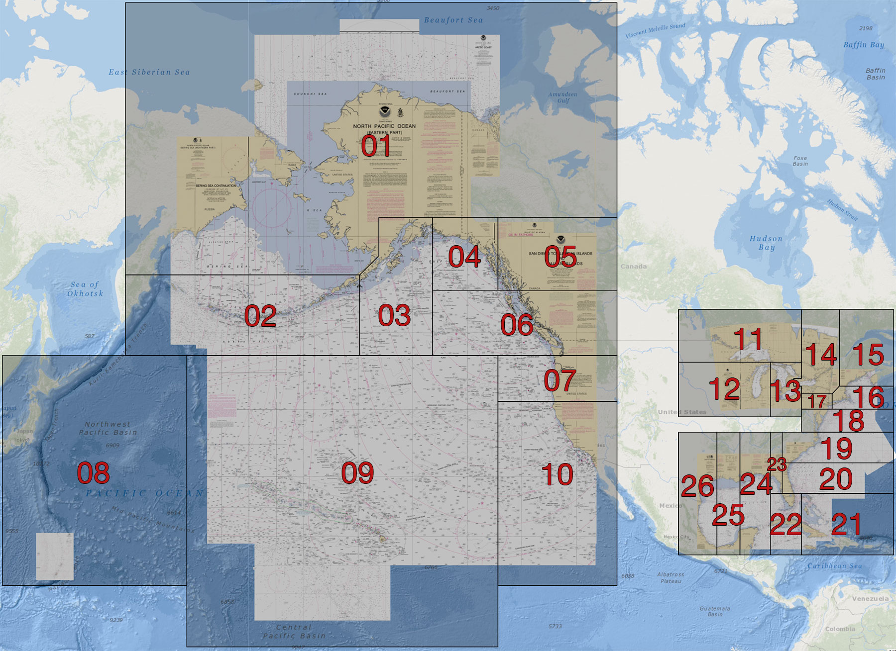

# NOAA Nautical Chart MBTiles

This is a list of available NOAA quilted nautical chart tilesets in MBTiles format. 
For the original NOAA Chart Tile Service please visit http://tileservice.charts.noaa.gov/

[NOAA Tileset locator](http://tileservice.charts.noaa.gov/tileset.html#50000_1-locator)

[NOAA Chart Tile Service Usage policy](https://tileservice.charts.noaa.gov/#usage-policy)

No | Baseline MBTiles | Updates MBTiles
-- | ---------------- | ---------------
01|[Download Baseline](http://tileservice.charts.noaa.gov/mbtiles/50000_1/MBTILES_01.mbtiles)|[Updates](http://tileservice.charts.noaa.gov/mbtiles/50000_1/MBTILES_01-updates.mbtiles)
02|[Download Baseline](http://tileservice.charts.noaa.gov/mbtiles/50000_1/MBTILES_02.mbtiles)|[Updates](http://tileservice.charts.noaa.gov/mbtiles/50000_1/MBTILES_02-updates.mbtiles)
03|[Download Baseline](http://tileservice.charts.noaa.gov/mbtiles/50000_1/MBTILES_03.mbtiles)|[Updates](http://tileservice.charts.noaa.gov/mbtiles/50000_1/MBTILES_03-updates.mbtiles)
04|[Download Baseline](http://tileservice.charts.noaa.gov/mbtiles/50000_1/MBTILES_04.mbtiles)|[Updates](http://tileservice.charts.noaa.gov/mbtiles/50000_1/MBTILES_04-updates.mbtiles)
05|[Download Baseline](http://tileservice.charts.noaa.gov/mbtiles/50000_1/MBTILES_05.mbtiles)|[Updates](http://tileservice.charts.noaa.gov/mbtiles/50000_1/MBTILES_05-updates.mbtiles)
06|[Download Baseline](http://tileservice.charts.noaa.gov/mbtiles/50000_1/MBTILES_06.mbtiles)|[Updates](http://tileservice.charts.noaa.gov/mbtiles/50000_1/MBTILES_06-updates.mbtiles)
07|[Download Baseline](http://tileservice.charts.noaa.gov/mbtiles/50000_1/MBTILES_07.mbtiles)|[Updates](http://tileservice.charts.noaa.gov/mbtiles/50000_1/MBTILES_07-updates.mbtiles)
08|[Download Baseline](http://tileservice.charts.noaa.gov/mbtiles/50000_1/MBTILES_08.mbtiles)|[Updates](http://tileservice.charts.noaa.gov/mbtiles/50000_1/MBTILES_08-updates.mbtiles)
09|[Download Baseline](http://tileservice.charts.noaa.gov/mbtiles/50000_1/MBTILES_09.mbtiles)|[Updates](http://tileservice.charts.noaa.gov/mbtiles/50000_1/MBTILES_09-updates.mbtiles)
10|[Download Baseline](http://tileservice.charts.noaa.gov/mbtiles/50000_1/MBTILES_10.mbtiles)|[Updates](http://tileservice.charts.noaa.gov/mbtiles/50000_1/MBTILES_10-updates.mbtiles)
11|[Download Baseline](http://tileservice.charts.noaa.gov/mbtiles/50000_1/MBTILES_11.mbtiles)|[Updates](http://tileservice.charts.noaa.gov/mbtiles/50000_1/MBTILES_11-updates.mbtiles)
12|[Download Baseline](http://tileservice.charts.noaa.gov/mbtiles/50000_1/MBTILES_12.mbtiles)|[Updates](http://tileservice.charts.noaa.gov/mbtiles/50000_1/MBTILES_12-updates.mbtiles)
13|[Download Baseline](http://tileservice.charts.noaa.gov/mbtiles/50000_1/MBTILES_13.mbtiles)|[Updates](http://tileservice.charts.noaa.gov/mbtiles/50000_1/MBTILES_13-updates.mbtiles)
14|[Download Baseline](http://tileservice.charts.noaa.gov/mbtiles/50000_1/MBTILES_14.mbtiles)|[Updates](http://tileservice.charts.noaa.gov/mbtiles/50000_1/MBTILES_14-updates.mbtiles)
15|[Download Baseline](http://tileservice.charts.noaa.gov/mbtiles/50000_1/MBTILES_15.mbtiles)|[Updates](http://tileservice.charts.noaa.gov/mbtiles/50000_1/MBTILES_15-updates.mbtiles)
16|[Download Baseline](http://tileservice.charts.noaa.gov/mbtiles/50000_1/MBTILES_16.mbtiles)|[Updates](http://tileservice.charts.noaa.gov/mbtiles/50000_1/MBTILES_16-updates.mbtiles)
17|[Download Baseline](http://tileservice.charts.noaa.gov/mbtiles/50000_1/MBTILES_17.mbtiles)|[Updates](http://tileservice.charts.noaa.gov/mbtiles/50000_1/MBTILES_17-updates.mbtiles)
18|[Download Baseline](http://tileservice.charts.noaa.gov/mbtiles/50000_1/MBTILES_18.mbtiles)|[Updates](http://tileservice.charts.noaa.gov/mbtiles/50000_1/MBTILES_18-updates.mbtiles)
19|[Download Baseline](http://tileservice.charts.noaa.gov/mbtiles/50000_1/MBTILES_19.mbtiles)|[Updates](http://tileservice.charts.noaa.gov/mbtiles/50000_1/MBTILES_19-updates.mbtiles)
20|[Download Baseline](http://tileservice.charts.noaa.gov/mbtiles/50000_1/MBTILES_20.mbtiles)|[Updates](http://tileservice.charts.noaa.gov/mbtiles/50000_1/MBTILES_20-updates.mbtiles)
21|[Download Baseline](http://tileservice.charts.noaa.gov/mbtiles/50000_1/MBTILES_21.mbtiles)|[Updates](http://tileservice.charts.noaa.gov/mbtiles/50000_1/MBTILES_21-updates.mbtiles)
22|[Download Baseline](http://tileservice.charts.noaa.gov/mbtiles/50000_1/MBTILES_22.mbtiles)|[Updates](http://tileservice.charts.noaa.gov/mbtiles/50000_1/MBTILES_22-updates.mbtiles)
23|[Download Baseline](http://tileservice.charts.noaa.gov/mbtiles/50000_1/MBTILES_23.mbtiles)|[Updates](http://tileservice.charts.noaa.gov/mbtiles/50000_1/MBTILES_23-updates.mbtiles)
24|[Download Baseline](http://tileservice.charts.noaa.gov/mbtiles/50000_1/MBTILES_24.mbtiles)|[Updates](http://tileservice.charts.noaa.gov/mbtiles/50000_1/MBTILES_24-updates.mbtiles)
25|[Download Baseline](http://tileservice.charts.noaa.gov/mbtiles/50000_1/MBTILES_25.mbtiles)|[Updates](http://tileservice.charts.noaa.gov/mbtiles/50000_1/MBTILES_25-updates.mbtiles)
26|[Download Baseline](http://tileservice.charts.noaa.gov/mbtiles/50000_1/MBTILES_26.mbtiles)|[Updates](http://tileservice.charts.noaa.gov/mbtiles/50000_1/MBTILES_26-updates.mbtiles)
